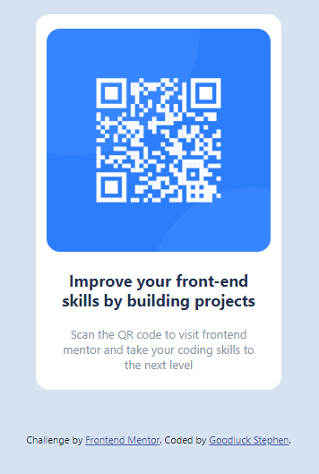

# Frontend Mentor - QR code component solution

This is a solution to the [QR code component challenge on Frontend Mentor](https://goodluck1455.github.io/Frontend-Mentor-QR-code-component/). 

## Table of contents

- [Overview](#overview)
  - [Screenshot](#screenshot)
  - [Links](#links)
  - [Built with](#built-with)
  - [What I learned](#what-i-learned)
  


## Overview

### Screenshot




### Links

- Solution URL: [Click to view the solution](https://goodluck1455.github.io/Frontend-Mentor-QR-code-component/)
- Live Site URL: [Click to view the solution](https://goodluck1455.github.io/Frontend-Mentor-QR-code-component/)


### Built with

- Semantic HTML5 markup
- Bootstrap
- CSS 
- Flexbox
- Mobile-first workflow


### What I learned

Working on this project provided me with valuable insights into utilizing media queries effectively, particularly in terms of organizing their maximum width in descending order.


`````htm

/******************************
      GOODLUCK STEPHEN
********************************/

````

